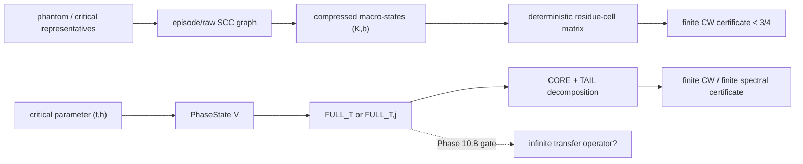

# Phase 10 Operator Gate Dossier

Date: 2026-05-13

Status: first operational draft. This note is deliberately conservative:
it records what is certified, what is finite/computational, and what
would still be needed before invoking Lasota-Yorke, Hennion,
Keller-Liverani, or countable Markov shift machinery.

Primary workspace:

- `lean/TODO.md`
- `lean/CollatzShadowing/Operator.lean`
- `lean/CollatzShadowing/EpisodeGraph.lean`
- `lean/CollatzShadowing/Bound.lean`
- `lean/CollatzShadowing/Generated/K16S16KDeterministicCW.lean`
- `scripts/spectral_program/75_critical_symbolic_operator.py`
- `scripts/spectral_program/77_high_bit_tail_bound.py`
- `scripts/phantom_taxonomy/deterministic_residue_transfer.py`

Local literature consulted:

- `arxiv-affini/Studi_Operatori_Trasferimento/ocr_text/baladi_positive_transfer_operators.ocr.txt`
- `arxiv-affini/Studi_Operatori_Trasferimento/ocr_text/gibbs1.ocr.txt`
- `arxiv-affini/Studi_Operatori_Trasferimento/ocr_text/pr_4.ocr.txt`
- local PDFs for Keller-Liverani 1999, Hennion, GDMS, countable
  branches, certified spectral approximation, p-adic shadowing, and
  Chang 2026.

Primary online sources checked where useful:

- Keller-Liverani, Numdam: <https://www.numdam.org/item/ASNSP_1999_4_28_1_141_0/>
- Chang 2026: <https://arxiv.org/abs/2603.11066>
- Countable branches: <https://arxiv.org/abs/2406.19929>
- Certified spectral approximation: <https://arxiv.org/abs/2602.19435>
- Countable Markov shifts with holes: <https://arxiv.org/abs/2207.08085>
- p-adic shadowing: <https://arxiv.org/abs/2001.02737>

## 1. Executive Summary

Phase 10 should currently be treated as an operator-identification
program, not as a spectral-gap proof. The central fork is Task 10.B in
`lean/TODO.md`: decide whether the finite matrices called
`FULL_{T,j}` / `full_T` are exact projections, truncations,
compressions, Ulam-type approximations, Galerkin approximations, or only
finite artifacts with no canonical infinite kernel.

Current verdict:

- no natural infinite operator has yet been identified whose projections
  are demonstrably the generated `FULL` matrices;
- several plausible candidates exist, especially a killed weighted
  first-return operator on a 2-adic/symbolic state space;
- diagnostics after the first draft favor a labelled
  phase-depth/`delta`-tail model rather than exact local constancy on the
  original `PhaseState` quotient;
- at `T = 16`, `j_count = 8`, the global weighted `delta` tail is small
  after the existing `2^{-delta}` normalization, but the corresponding
  uniform source-cell tail bound is not automatic;
- the finite-rank fallback is already much stronger than the analytic
  branch: the deterministic K16 `(K,b)` certificate is formalized in
  Lean with exact alpha `3/4`;
- no statement in Phase 10 should claim Conjecture 6, a spectral gap, or
  asymptotic subcriticality.

## 2. What Is Already Demonstrated or Certified

### 2.1 Lean-level finite definitions

`Operator.lean` defines a refined phase state

```text
PhaseState V = Fin (V+1) x Fin 4 x Fin 4.
```

This represents:

- capped `nu_2(t)`;
- odd part of `t` modulo `4`;
- hit/phase index `h` modulo `4`.

The same file defines:

- `TransferMatrix V := Matrix (PhaseState V) (PhaseState V) NNReal`;
- `RowSubstochastic M := forall i, sum_j M i j <= 1`;
- exact rational matrix entries via `ProbabilityEntry`;
- finite decompositions `full = core + tail` through
  `OperatorDecomposition`.

This is a finite API. It does not by itself define an infinite operator.

### 2.2 Episode graph layer

`EpisodeGraph.lean` defines episode nodes with coordinates `(k,c,b)` and
finite truncations

```text
TruncatedEpisodeNode K C B = Fin K x Fin C x Fin B.
```

It also defines finite directed graphs, reachability, SCC certificates,
hub SCC certificates, and critical SCC certificates. This is a
combinatorial finite graph layer. It is not yet a countable Markov shift
theorem.

### 2.3 Collatz-Wielandt layer

`Bound.lean` defines finite CW certificates:

```text
FiniteCWCertificate M basis alpha :=
  forall i, Matrix.mulVec M basis.vector i <= alpha * basis.vector i.
```

The same file proves finite spectral-radius consequences after
conjugation by the positive CW vector. These are legitimate finite
matrix theorems.

### 2.4 Deterministic K16 certificate

`Generated/K16S16KDeterministicCW.lean` imports an exact deterministic
finite residue-cell `(K,b)` certificate:

- 37 macro-states;
- 182 edge types;
- alpha `3/4`;
- exact maximum ratio
  `90833233962213/129559208330288 < 3/4`;
- sensitivity checks at `lift_bits = 5, 6` are reported outside Lean as
  still below `3/4`.

This certifies a declared finite residue-cell scope. It does not prove
an infinite operator bound.

## 3. Finite Layer Reconstruction

### 3.1 Conceptual diagram



### 3.2 What `full_T` represents locally

The script `75_critical_symbolic_operator.py` builds a finite modular
operator around one critical phantom node. For finite `T`, it enumerates
`t mod 2^T` and `h mod H`, then traces until either:

- a first return to the same critical node occurs; or
- a terminal event occurs, typically drop below start or unresolved
  budget.

The state used for the finite quotient is

```text
(capped nu_2(t), odd(t) mod 2^m_odd, h mod 2^m_hit).
```

An edge receives weight `2^{-s * delta_t_bits}` in the spectral scripts.
Terminal events contribute to denominators but have no outgoing edge.

Thus `full_T` is best described as a finite killed weighted first-return
matrix for a chosen finite modular sampling scheme.

### 3.3 What `FULL_{T,j}` / high-bit tail represents

The script `77_high_bit_tail_bound.py` tests the fact that transition
signatures are not determined by `t mod 2^T` alone. It samples lifts

```text
t = r + j * 2^T
```

for a finite set of `j` values. For each `(r,h)` group, the majority
signature is assigned to `CORE`; minority/high-bit-dependent signatures
are assigned to `TAIL`. The script records

```text
FULL = CORE + TAIL.
```

This is an important finite diagnostic. It is not yet a proof that
`CORE` is an infinite leading operator, nor that `TAIL` is a small
perturbation in a Banach-space norm.

### 3.4 CORE, TAIL, SCC, and bounds

The SCC layer identifies finite recurring episode structure. The
operator layer then adds weights and killing. CORE/TAIL is not an SCC
notion: it is a decomposition of observed finite transition signatures
into a majority component and a residual high-bit-dependent component.

The finite CW bounds prove:

- for the exact generated finite matrix, there is a positive vector `v`
  such that `M v <= alpha v`;
- consequently the finite real spectral radius is at most `alpha`.

They do not prove:

- convergence as `T -> infinity`;
- convergence as `j -> infinity`;
- a uniform infinite tail estimate;
- a spectral gap for any infinite operator.

### 3.5 Orientation warning

There is a technical orientation issue to settle before 10.D. The phase
API defines row-substochastic matrices by summing rows, while finite CW
uses `Matrix.mulVec`. The deterministic K16 generated file comments
that rows are destinations and columns are sources for `(P v)[dst]`.

This is not fatal, but every future formula must specify whether it is
written in Markov push-forward convention, Koopman/function convention,
or Ruelle/preimage convention. Otherwise one can accidentally prove a
statement about a transpose.

Follow-up note: `notes/phase10_orientation.md` fixes the working
terminology `K(src,dst)`, `M_row`, `M_in`, `U_K`, `L_K`, and `P_K^*`,
and records which current generated layers use row-source versus
incoming convention.

Follow-up note: `notes/phase10_candidate_operator.md` gives the first
formal candidate definition of the raw positive-integer first-return
kernel and the conditional 2-adic extension required for a positive
10.B outcome.

Follow-up note: `notes/phase10_cylinder_stability_plan.md` specifies the
first diagnostic for Gate 10.B: cylinder-level stability of terminal
status, destination phase, weight exponent `delta`, and full return
signature across high-bit lifts.

Follow-up note: `notes/phase10_cylinder_stability_results.md` records
the first diagnostic runs.  The `T = 10`, `j <= 128` run recommends
`enlarge symbolic state`, because several bulk cylinders have stable
return status but strongly split destination phase.  A global
refinement-coordinate score, using a stricter average bucket-size
threshold, found `j mod 32` to be the strongest simple destination-phase
coordinate at both `T = 10` and `T = 11`.  The same coordinate does not
explain the full weighted signature well enough to define the operator.
A deeper-cylinder test at `T = 15` confirms that five extra 2-adic bits
help substantially, but still do not give local constancy or a
projection identity.
The `T = 15` delta-obstruction summary shows that a nontrivial part of
the remaining full-signature failure is exactly weight-exponent
variation, while another part still requires deeper phase information.
Weighted-tail diagnostics at `T = 16`, `j_count = 8`, and `T = 15`,
`j_count = 32`, both put the global `delta > 5` tail below `0.001`
after `2^{-delta}` weighting, but local source-cell tails still require
a separate hypothesis.
An adjacent-block diagnostic at `T = 15`, `j_count = 32`, gives
full-signature TV p95 `0.1875` and dominant-flip fraction `0.0124817`,
showing that majority stability and distributional stability must be
tracked separately.
The analogous short-block check at `T = 16`, `j_count = 8`, gives
full-signature TV p95 `0.25`, so the block-Cauchy question remains
open and cannot be replaced by the high average majority fractions.
Bad-cell stratification at `T = 16`, `j_count = 8`, shows that full
instability is concentrated in recognizable source strata, for example
`v2=2, odd=3`, where destination phase is mostly exact but full
signature is often not.  This suggests a possible drift-weight
direction, not a theorem.

Follow-up note: `notes/phase10_finite_rank_fallback.md` isolates the
finite-rank fallback theorem candidate around the existing K16
deterministic `(K,b)` CW certificate.

Follow-up note: `notes/phase10_literature_source_map.md` records the
local PDF/OCR sources behind the literature matrix and the precise
hypothesis warnings for each source family.

Follow-up note: `notes/phase10_refined_state_candidate.md` records the
current refined-state interpretation: `j mod 32` is best viewed as five
additional 2-adic bits beyond the base cylinder, while the remaining
full-signature variation is mainly `delta` and cannot be inserted into
the source state without a branch-measurability proof.

Follow-up note: `notes/phase10_highbit_limit_conventions.md` separates
four possible meanings of `j -> infinity`: deeper 2-adic refinement,
Cesaro high-lift averaging, Haar projection on `Z_2`, or no canonical
limit.

Follow-up note: `notes/phase10_conditional_refined_kernel.md` defines a
conditional labelled refined kernel `K_{T,a,N}` and the exact hypotheses
needed before such kernels can be used in a Keller-Liverani/Hennion
program.

Follow-up note: `notes/phase10_banach_implications_after_diagnostics.md`
updates the Banach-space ranking: labelled countable symbolic/return
spaces and martingale 2-adic cylinder BV now outrank plain Lipschitz on
`Z_2 x H`.

Follow-up note: `notes/phase10_norm_constants_from_diagnostics.md`
records which finite diagnostic constants could feed depth, tail, and
block-Cauchy error terms, and which theorem hypotheses they do not
replace.

Follow-up note: `notes/phase10_source_stratum_drift_ansatz.md` spells
out a possible source-stratum weight `W`, the corresponding finite
ratio `R_W(src)`, and kill criteria for rejecting the idea as
overfitting.  The first small finite probe at `T = 12`, `j_count = 16`,
does not falsify the idea, but it is not strong evidence: the identity
weight already has max ratio below `1`, and the best safe coarse weight
only modestly improves p95.  A harder probe at `T = 15`, `j_count = 16`,
is negative for the naive three-parameter weight family: nontrivial
weights improve p95 only by creating cells with ratio at least `1`.

Follow-up note: `notes/phase10_gate10B_provisional_decision.md` records
the current Gate 10.B decision: the exact-projection branch is not
supported, the labelled/distributional analytic branch remains
conditional, and the finite-rank fallback is the safer theorem-producing
branch.

Follow-up note: `notes/phase10_mixed_norm_candidate.md` fixes the first
explicit Banach-pair target: a martingale/cylinder norm on `Z_2 x H`,
labelled delta truncation, projection maps, and a required mixed-norm
error

```text
|| U_s - I_{T,a,L,N} K_{T,a,L,N} E_{T+a} ||_{B_s -> B_w}
  <= epsilon(T,a,L,N).
```

It identifies adjacent-block TV, not majority stability, as the fragile
term to test next.  The first fixed-`T=15` block-doubling check is
compatible with this target: full-signature TV p95 decreases
`0.25 -> 0.1875 -> 0.15625` for block sizes `8 -> 16 -> 32`, but this
is still diagnostic rather than convergence.  A truncated-label check at
block size `32` shows that clipping large `delta` labels barely changes
full TV, so bounded return-label variation must be included in
`A_block(N)`.  The follow-up bounded-label excess diagnostic separates
destination-phase movement from label movement: at `T = 15`, block size
`32`, the full-label excess over phase TV has mean `0.00791955`, p95
`0.0625`, p99 `0.09375`, and max `0.25`.  This is smaller than the
phase movement but not zero; it should be modelled as a separate
`A_label_bounded(B,L)` term, not hidden inside the large-`delta` tail.

Follow-up note: `notes/phase10_error_decomposition.md` names the
current approximation-error budget:

```text
A_projection + A_phase_block + A_label_bounded
+ DeltaTail_global + DeltaTail_local + BoundaryError
+ DriftExcess + OrientationError.
```

This is a bookkeeping target only.  The constants have no theorem
status until an infinite operator, Banach pair, and projection scheme
are fixed.

Follow-up note: `notes/phase10_operator_choice.md` fixes the current
working convention: the primary object is the killed labelled kernel
`K(src,dst)`, the primary analytic operator is the row-source
function-side `U_s`, the push-forward `P_s^*` is retained as the dual
mass/killing interpretation, and the Ruelle/preimage `L_s` is secondary
until a genuine inverse-branch structure exists.

Follow-up diagnostic: `scripts/spectral_program/99_error_budget_summary.py`
aggregates the currently named finite proxies.  On the active
`T15_B32_j64` dataset, it reports `DeltaTail_global(5) = 0.000830424`,
`DeltaTail_local_p95(5) = 0.027027`, `A_phase_block` p95 `0.125`, and
full `A_label_bounded` p95 `0.0625`.  It also reports
`DeltaTail_local_max(5) = 1`, so the diagnostic still does not provide
a uniform local tail bound.

Fallback update: `notes/phase10_finite_rank_fallback.md` now includes a
K20 smoke preflight.  The smoke `(K,b)` deterministic residue-cell
matrix has a verified exact CW ratio
`42001755821431/62996587868160 < 3/4`, but this is explicitly not a
production K20 theorem because the SCC input is only a small smoke run.

## 4. Gate 10.B: Infinite Model Candidate Analysis

### Model A: killed weighted first return on `Z_2 x H`

Space:

```text
X = Z_2 x H,     H = Z/4Z or Z/2^m Z.
```

Topology and sigma-algebra:

- product of the profinite topology on `Z_2` and the discrete topology
  on finite `H`;
- Borel sigma-algebra;
- Haar measure on `Z_2` times counting measure on `H`, if a Markov/Ulam
  interpretation is chosen.

State variables:

- local lift parameter `t`;
- hit/phase residue `h`;
- optionally the monitored critical node.

Candidate dynamics:

```text
tau(t,h) = first returned parameter/state,
```

defined only if the orbit returns before terminal killing.

Relation with the finite matrices:

- projection to `t mod 2^T`, or to
  `(nu_2(t) capped, odd(t) mod 4, h mod 4)`;
- a finite entry should be a conditional Haar average over source
  cylinders.

What fails today:

- the current finite `j` lift sampling is not proved to equal Haar
  conditional expectation;
- terminal drop below start is archimedean and may not be clopen in the
  2-adic topology;
- `delta_t_bits` is an archimedean size statistic, not a continuous
  2-adic observable.

Verdict: plausible but not closed.

### Model B: countable Markov shift of return episodes

Space:

```text
Sigma_A = {admissible sequences of return signatures}
```

over a countable alphabet of branches or episode signatures.

Topology and sigma-algebra:

- cylinder topology;
- Borel sigma-algebra;
- thermodynamic formalism through Gurevich pressure if the graph is
  topologically transitive and the potential is summable.

State variables:

- source phase or episode node;
- return signature;
- target phase;
- weight exponent `delta`.

Relation with the finite matrices:

- finite matrices could be truncations or lumpings if first-return
  signatures are locally constant on cylinders;
- `PhaseState V` would be a coarse finite factor.

What fails today:

- no countable alphabet and adjacency matrix have been defined;
- BIP/finitely irreducible properties are not proved;
- summability of `2^{-s delta}` over branches is unknown;
- finite `FULL_{T,j}` is a statistic, not yet a canonical truncation.

Verdict: plausible if 2-adic first-return branches can be made symbolic;
otherwise a false analogy.

### Model C: finite phase times high-bit tail

Space:

```text
Y_T = finite phase state x high-bit tail.
```

The tail may be represented by `Z_2`, by a one-sided binary shift, or by
an inverse limit of lift indices.

Relation with the finite matrices:

- `FULL_{T,j}` is naturally interpreted as a finite sample over the first
  `j` high-bit lifts;
- CORE is the majority signature over that sample;
- TAIL is the finite residual.

What a projection would be:

- conditional expectation over the high-bit tail with respect to a
  specified measure;
- or a Galerkin/Ulam discretization of an operator on the tail.

What fails today:

- majority signature is not a linear projection;
- prefix sampling in `j` is not automatically Haar sampling;
- no convergence rate in `j` is proved.

Verdict: unclear. This is the model closest to the actual scripts, but
also the one where finite-artifact risk is highest.

### Model D: countable episode graph operator

Space:

```text
E = countable set of raw phantom/episode nodes
```

with discrete topology and a killed substochastic kernel.

Relation with the finite matrices:

- K16 deterministic matrix is a finite residue-cell/lumped restriction;
- a possible infinite extension would add larger `K`, more nodes, and
  more residue cells.

What a projection would be:

- finite truncation by `K <= K0`;
- lumping by `(K,b)` or `(K,L,b)`.

What fails today:

- lumpability is only finite-scope, not global;
- no drift estimate over all `K`;
- no compactness unless a weighted sequence space is chosen carefully.

Verdict: best fallback branch; analytic branch possible only as a
weighted countable-state Markov-kernel problem.

### Model E: Chang-style residue operator

Space:

```text
(Z / 2^K Z)_odd
```

or its inverse limit inside `Z_2`.

Relation with the finite matrices:

- Chang's finite residue operators have canonical projections;
- they are not the same object as the current killed, weighted,
  critical-return `FULL` matrices.

What fails:

- Chang's operator tracks Syracuse residue dynamics, not the refined
  phase quotient of phantom return episodes;
- nilpotence/absorbing behavior in fixed-depth residue operators is not
  a spectral-gap proof for `full_T`.

Verdict: partially compatible terminology, unlikely as the 10.B kernel.

## 5. Candidate Operator Formulas

### Formula A: killed weighted push-forward

Let `X = Z_2 x H`. Let `D subset X` be the set of nonterminal states for
which the first return is defined, and let

```text
tau : D -> X
```

be the first-return map. Let

```text
w_s(x) = 2^{-s delta(x)}.
```

On measures:

```text
(P_s mu)(B) = integral_{D cap tau^{-1}(B)} w_s(x) dmu(x).
```

On observables in Koopman convention:

```text
(U_s f)(x) = 1_D(x) w_s(x) f(tau x).
```

Terminal mass is lost. A finite Markov-style matrix would be

```text
P_ij = m(C_i)^(-1)
       integral_{C_i cap tau^{-1}(C_j)} w_s dm.
```

Spectral target:

```text
r(P_s) < 1
```

in a chosen strong Banach norm, or at least a certified finite
truncation theorem.

Risks:

- `delta` may not be cylinder-constant;
- terminal condition may not be 2-adically regular;
- finite `FULL_{T,j}` may not equal these integrals.

### Formula B: Ruelle/preimage operator

With the same `tau : D -> X`, define

```text
(L_s f)(x) =
  sum_{y in D : tau(y) = x} 2^{-s delta(y)} f(y).
```

This is the natural orientation for thermodynamic formalism. It is
compatible with countable Markov shift machinery if the inverse branches
are countable, summable, and have controlled distortion.

Spectral target:

```text
r_ess(L_s) <= alpha < 1,
```

and then, only under additional hypotheses, control of isolated
spectrum.

Risks:

- preimage count may be infinite with divergent total weight;
- BIP/positive recurrence are not automatic;
- the generated row-normalized matrices may represent a transpose or a
  push-forward normalization.

### Formula C: countable killed episode kernel

Let `E` be a countable episode-state set and let `p(u,v)` be the
probability/weight of a nonterminal transition from `u` to `v`.

On weighted functions:

```text
(P f)(u) = sum_v p(u,v) f(v).
```

On measures, use the transpose. A drift weight `W : E -> [1,infty)` is
needed:

```text
sum_v p(u,v) W(v) <= alpha W(u) + b 1_F(u).
```

This is the cleanest home for the K16 finite-rank fallback. It is less
directly tied to `PhaseState V` unless a precise quotient map from
episodes to phase states is fixed.

## 6. Banach-Space Candidate Matrix

| Rank | Candidate space | Strong norm | Weak norm | Compactness | Relation to finite quotient | Main risk |
|---:|---|---|---|---|---|---|
| 1 | labelled countable symbolic / return-signature space | `sup |f|/W + Var_or_Holder(f/W)` | weighted local `L1` or local sup | cylinder truncation plus explicit tail tightness | finite partitions become labelled cylinder truncations | BIP/summability/recurrence may fail |
| 2 | martingale/BV on binary residue-tree partitions | `||f||_infty + sum_a beta_a Var_a(f)` | Haar/cylinder `L1` | martingale compactness if tail variation is summable | deeper `j mod 2^a` refinements are natural | nonstandard; return/killing depth loss open |
| 3 | weighted `ell_infty` / drift space on episode graph | `sup |f(u)|/W(u)` | local sup or weighted `ell_1` dual | only with tight drift or finite-rank truncation | K16 finite matrix is direct truncation/lumping | little smoothing, no automatic compactness |
| 4 | Lipschitz on `Z_2 x H` | `||f||_infty + Lip_2(f)` | `L1` or `C^0` | profinite Arzela-Ascoli style | phase states are cylinder quotients | `delta` and killing are not visibly continuous |
| 5 | p-adic analytic/Mahler spaces | coefficient-decay norm | sup or weaker coefficient norm | compact coefficient embeddings possible | possible if branches affine analytic | currently speculative |
| 6 | classical interval BV with countable branches | BV interval norm | `L1` | standard | only through an artificial coding | likely false analogy |

Provisional recommendation:

1. formulate the next analytic candidate as a labelled symbolic or
   martingale/cylinder operator with explicit `delta` tails;
2. use plain `Z_2 x H` Lipschitz only as coordinate language, not as the
   leading Banach hypothesis;
3. keep weighted `ell_infty` on episodes for the finite-rank fallback.

## 7. Literature Hypothesis Matrix

| Source | Useful theorem | Hypotheses | Maps well to this project | Does not map / risk |
|---|---|---|---|---|
| Baladi | Lasota-Yorke, BV transfer operators, perturbation context | expanding/regular maps, BV or anisotropic spaces | good language for LY and perturbation discipline | not a substitute for defining `L` |
| Hennion | quasi-compactness from compact strong-to-weak embedding plus LY-type bound | bounded operator on two norms, compact embedding, growth control | suitable for positive killed kernels if regular | all local hypotheses still missing |
| Keller-Liverani | stability of isolated spectrum under mixed-norm perturbations | uniform LY, `||L_N-L||_{s->w}->0`, resolvent control | exact target for finite approximations | unusable if `FULL` is not an approximation of `L` |
| Sarig | thermodynamic formalism for CMS, Gurevich pressure, BIP | topologically transitive CMS, summable variation/potential, recurrence | relevant if return episodes form a CMS | BIP/positive recurrence not automatic |
| Bowen | finite SFT equilibrium formalism | finite Markov partitions, bounded distortion | finite symbolic intuition | dangerous if transferred to countable/killed case |
| GDMS | graph-directed Markov systems, conformal branches, pressure | contracting branches and distortion control | possible if inverse return maps are contractions | current data are transition statistics, not GDMS maps |
| Countable-branch LY, arXiv:2406.19929 | LY and quasi-compactness for countably many branches | interval branch geometry and BV assumptions | template for infinite-branch estimates | geometry differs substantially |
| CMS with holes, arXiv:2207.08085 | RPF/quasi-compactness and escape rates for open CMS | weak Lipschitz summable potential, finite irreducibility/BIP | good model for killing | only after CMS is constructed |
| Certified spectral approximation, arXiv:2602.19435 | a posteriori certified spectral data from finite-rank approximations | DFLY setting, finite-rank error bounds | relevant after KL hypotheses | cannot create the infinite operator |
| p-adic shadowing, arXiv:2001.02737 | shadowing/stability on `Z_p`, locally scaling maps | p-adic Lipschitz/local scaling | supports profinite modeling | not transfer-operator spectral theory |
| Chang 2026, arXiv:2603.11066 | residue/Syracuse transfer operators and phantom cycles | residue spaces modulo powers of 2 | terminology and phantom-root comparison | operator is different; not leverage for `full_T` gap |

## 8. Target Lasota-Yorke Inequality

Do not state this as proved. The target is:

```text
||L f||_strong <= alpha ||f||_strong + C ||f||_weak,
alpha < 1.
```

For iterates:

```text
||L^n f||_strong <= A alpha^n ||f||_strong + B R^n ||f||_weak.
```

For a Ruelle/preimage operator, a plausible alpha has the form

```text
alpha =
  sup_x sum_{tau(y)=x}
    2^{-s delta(y)}
    Lip(branch_y)^beta
    W(y)/W(x),
```

with additional distortion terms absorbed into `C ||f||_weak`.

For a push-forward Markov kernel, the analogous drift target is

```text
sum_dst P(src,dst) W(dst) <= alpha W(src) + C 1_F(src).
```

The diagnostics suggest splitting `alpha` into at least three named
pieces:

```text
alpha <= alpha_phase(a)
       + C_delta DeltaTail_global(L)
       + C_local DeltaTail_local(L)
       + C_label A_label_bounded(B,L)
       + epsilon_boundary(T,a,L),
```

where `a` is the extra 2-adic depth and `L` is the retained
return-exponent cutoff.  The new `A_label_bounded(B,L)` term measures
distributional variation among retained return labels after the
destination phase has already been charged.  On the tested finite
windows, `DeltaTail_global(5)` is about `8.5e-4`, but this is only
diagnostic.  The local tail term is the harder one and cannot be
omitted; neither can the bounded-label term.

The killing helps weak mass but does not automatically help the strong
seminorm; boundary regularity of the killed domain must be controlled.

Missing lemmas:

| Lemma | Type | Status |
|---|---|---|
| first-return domain is Borel/clopen at controlled cylinder depth | analytic/combinatorial | open |
| first-return map is locally constant or Lipschitz with explicit depth loss | analytic | open |
| `delta` has bounded variation/distortion on cylinders | analytic/computational | open |
| branch weight sum is finite | combinatorial/analytic | open |
| tail drift bound for high state/high lift | computational plus proof | open |
| chosen strong space embeds compactly into weak space | functional analytic | open |
| finite projections converge in mixed norm | analytic/computational | open |
| Lean matrices match the chosen orientation | definitional/engineering | open |

## 9. Hennion and Keller-Liverani Skeletons

### 9.1 Hennion skeleton

Conditional proposition:

Let `B_s` and `B_w` be Banach spaces with compact embedding
`B_s -> B_w`. Let `L` be bounded on both spaces. Assume there are
constants `A,B,C,alpha,R` with `alpha < R` such that

```text
||L^n f||_s <= A alpha^n ||f||_s + B R^n ||f||_w,
||L^n f||_w <= C R^n ||f||_w.
```

Then Hennion-type theory gives an essential spectral radius bound at
the scale determined by `alpha` and `R`. If the spectral radius is
strictly larger than the essential bound, `L` is quasi-compact.

Useful conclusion:

- possible isolation of peripheral spectrum;
- possible path to stability and finite-rank approximation.

Missing local hypotheses:

- compact embedding;
- LY inequality;
- weak growth bound;
- boundedness of killed operator;
- identification of `L`.

Failure modes:

- no tightness in the tail;
- `alpha >= 1`;
- infinite branch sum diverges;
- killing creates discontinuities;
- finite matrices are not approximants of `L`.

### 9.2 Keller-Liverani skeleton

Conditional proposition:

Let `L_N` be finite-rank approximations of `L` on `B_s` and `B_w`.
Assume:

```text
sup_N ||L_N^n||_w <= C R^n,
||L_N^n f||_s <= A alpha^n ||f||_s + B R^n ||f||_w,
||L_N - L||_{s -> w} -> 0.
```

Assume also resolvent bounds on the region where spectral data are to be
compared. Then isolated spectral data outside the essential disk are
stable under `L_N`.

Missing local hypotheses:

- exact definition of `L_N`;
- proof that generated `FULL` matrices are those `L_N`, or controlled
  approximations of them;
- mixed-norm convergence;
- resolvent control or validated spectral enclosure.

Failure modes:

- finite matrices are empirical artifacts;
- non-normal resolvents are huge;
- `T`/`j` stability is only visual;
- orientation mismatch makes `L_N` a transpose of the intended operator.

## 10. Finite-Rank Fallback Theorem Candidate

If 10.B fails, the main Phase 10 output should be finite-rank and
honest:

Proposed claim:

For the declared K16 deterministic finite residue-cell scope and the
compressed macro-state space `(K,b)`, the generated substochastic
retention matrix has a positive Collatz-Wielandt vector with
alpha `3/4`. Therefore the finite matrix has real spectral radius at
most `3/4`.

Already available:

- deterministic residue-cell enumeration script;
- exact rational edge/certificate data;
- Lean-generated certificate;
- max ratio strictly below `3/4`;
- sensitivity checks for lift bits `5` and `6`.

Still missing for a standalone note/paper section:

- a self-contained mathematical definition of the finite residue-cell
  scope;
- a checked generator specification from residue cells to Lean matrix;
- K20 replication or a principled reason to stop at K16;
- choice of whether the theorem is stated on raw nodes, `(K,L,b)`, or
  `(K,b)`;
- table separating exact formal certificates from diagnostics.

## 11. Experiment Plan After Operator Choice

No new rho-number should be promoted before `L` and `B_s` are fixed.
Once they are fixed, useful experiments are:

| Experiment | Input | Output | Feeds |
|---|---|---|---|
| tail mass by cylinder/state | branch partition and killing rule | weighted tail sums | drift/weak bound |
| drift ratio | weight `W`, transitions | `sum p W(dst)/W(src)` | weighted LY |
| branch Lipschitz constants | explicit branch maps | contraction/depth loss | alpha |
| weight distortion | `delta` on cylinders | variation of `2^{-s delta}` | strong norm bound |
| mixed-norm convergence | `L`, projections `L_N` | `||L-L_N||_{s->w}` | Keller-Liverani |
| stability in `T` | canonical `L_T` sequence | convergence rate | projection validity |
| stability in `j` | canonical high-tail averaging | sampling/projection error | 10.B validation |
| CW vector regularity | finite CW vectors | strong norm growth | Banach candidate viability |
| resolvent bounds | validated finite matrices | pseudospectral enclosure | KL stability |

Falsifiers:

- tail mass does not decrease;
- branch sums diverge;
- CW vectors become more irregular with refinement;
- mixed-norm discrepancy does not tend to zero;
- high-bit majority split changes without convergence.

Diagnostics already run in this direction, still pre-theorem:

- `93_delta_tail_weight.py` estimates global and local weighted
  `delta` tails from the empirical `88` distributions;
- `94_block_cauchy_summary.py` estimates adjacent-block TV drift as a
  candidate distributional error for a Cesaro/high-lift interpretation;
- neither diagnostic supplies `L`, a Banach pair, compactness, or
  mixed-norm convergence.

## 12. Chang 2026 Compatibility

Chang 2026 is partially compatible:

- compatible in terminology around phantom cycles/roots;
- compatible as a warning that residue/Syracuse transfer operators can
  have strong finite-depth contraction phenomena;
- not compatible as a direct proof source for the present `FULL`
  matrices.

The current project's `full_T` is a killed weighted first-return matrix
on refined phase/episode data. Chang's operator is a residue/Syracuse
operator on odd residues modulo powers of two. The objects should be
compared, not identified.

Local source checked:

```text
/Volumes/AFUOCO/SVILUPPO/TEORIE/arxiv-affini/arxiv_top50/pdf/
2603.11066 - Exploring Collatz Dynamics with Human-LLM Collaboration.pdf
```

The local PDF is arXiv `2603.11066v6`, dated `22 Apr 2026`.  Its abstract
explicitly says that it does not prove Collatz and reports a spectral
gap for a Syracuse transfer operator on odd residues modulo powers of
two.  That is not the same object as the project's killed weighted
first-return `full_T` / `FULL_{T,j}` matrices.  Verdict:

```text
partially compatible, no direct leverage yet.
```

Online arXiv check on `2026-05-13` confirms that `v6`, last revised
`22 Apr 2026`, is still the current arXiv version.

## 13. Go / No-Go Criteria

Continue analytic branch if all of the following become true:

- a precise infinite phase space `X` is selected;
- an operator `L` is defined without reference to finite scripts;
- generated finite matrices are exact projections/truncations or have a
  proved approximation error;
- a strong/weak Banach pair is fixed;
- a plausible LY inequality has measurable constants;
- tail/drift estimates are not numerically contradicted.

Switch to fallback if any of the following persists:

- `FULL_{T,j}` remains only a finite majority/high-bit artifact;
- no canonical measure/projection explains `j`;
- killing or `delta` is too irregular for the chosen space;
- tail estimates fail;
- mixed-norm convergence cannot be formulated.

Ask for collaboration if:

- 2-adic Lipschitz/BV compactness is the obstacle;
- Sarig/BIP/positive recurrence is the obstacle;
- Hennion/Keller-Liverani hypotheses need specialist validation;
- finite-rank certification needs interval/validated numerics expertise.

Stop the analytic branch if:

- no natural infinite kernel survives 10.B;
- finite approximants demonstrably do not converge;
- all plausible Banach spaces make `L` unbounded.

Publication routing:

- v4: only if 10.B-10.D are coherent and 10.E/10.F produce honest
  conditional propositions;
- companion paper: if the analytic framework is useful but conditional;
- coauthored paper: if a collaborator supplies the missing functional
  analytic theorem;
- finite-rank computational note: if 10.B is negative.

## 14. Recommendation

Immediate recommendation:

1. formulate a hierarchical refinement model: deeper 2-adic cylinders
   for phase, labelled edges or return signatures for `delta`;
2. define what convergence in the high-bit lift coordinate should mean,
   because local constancy is not supported by the diagnostics;
3. keep the `Z_2 x H` killed first-return candidate conditional until a
   projection or convergence mechanism is specified;
4. define the Banach target around two separate tail constants:
   global weighted `delta` tail and weighted-local source-cell tail;
5. include bounded retained-label variation as an explicit block error,
   separate from both phase movement and large-`delta` tail;
6. test whether a source-stratum drift function can explain the bad
   phase/full cells without making the operator unbounded;
   the first naive family already looks weak at `T15_j16`;
7. in parallel, prepare the finite-rank K16/K20 fallback as an honest
   independent product.

Do not do yet:

- do not claim a spectral gap;
- do not advertise finite rho values as asymptotic evidence;
- do not invoke Hennion or Keller-Liverani without `L`,
  `B_s -> B_w`, and mixed-norm convergence;
- do not identify Chang's residue operator with `full_T`.

Collaboration request:

The best collaborator profile is a functional analyst/dynamicist with
experience in transfer operators for open systems or countable Markov
shifts, ideally comfortable with profinite or symbolic spaces. The
precise question to ask is not "can we prove Collatz?", but:

> Given this killed weighted first-return structure, is there a natural
> Banach space and projection scheme for which the generated finite
> matrices are legitimate approximants?

## 15. Concrete Next Actions

1. Define what `j -> infinity` should mean: Haar average, Cesaro over
   lift prefixes, or no canonical limit.
2. State a conditional refined-kernel model with:
   deeper phase cylinders, edge label `delta`, killing, and explicit
   tail error.
3. Test whether phase/delta distributions are Cauchy under block
   doubling only after naming the norm whose constant is being measured.
4. Formalize the weighted-tail diagnostics as candidate constants
   `DeltaTail_global(L)` and `DeltaTail_local(L)`.
5. Formalize adjacent-block TV as a candidate mixed-norm error, not as
   majority stability.
6. Formalize bounded retained-label excess as `A_label_bounded(B,L)`;
   do not merge it with the large-`delta` tail.
7. Try a source-stratum drift ansatz using `v2`, odd residue, and hit
   phase; reject it if it only restates the diagnostics without a
   summable weight.
8. If a projection exists, specify `L_T = E_T L I_T` and the mixed norm
   in which `L_T -> L`.
9. If no projection exists, freeze analytic Phase 10 and promote the
   K16/K20 finite-rank certificate branch.
10. Generate a K20 deterministic finite-rank candidate only after the
   fallback theorem statement is fixed.
